# Linked List (鏈表)
Linked List (鏈表) 是一種常見的資料結構，用來儲存一系列的元素。與陣列 (Array) 不同，Linked List 的元素稱為節點 (Node) 在記憶體中不必是連續的。每個節點除了儲存資料外，還會儲存一個指向下一個節點的參考 (指標)。

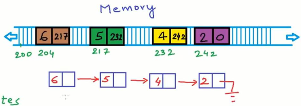
Figure 1. Singly Linked List

## 為什麼要用 Linked List?
相較 Array，Linked List 可以隨時增加或刪除元素，不需要事先宣告大小，而且在已知位置插入或刪除元素時，只需改變指標，不需搬移其他元素，也就是說如果程式需要頻繁的新增與刪除，Linked List 表現會更為優秀。

但是 Linked List 不論是哪種型態的，最多只會儲存前後 Node 的位址，所以當需要查詢的時候，就必須遍歷整個 Linked List，所以在這部分就不及 Array 的效率。

## Linked List 的種類
常見的 Linked List 有以下這幾種型態:

- Singly Linked List (單向鏈表): 每個 Node 只指向下一個節點。
- Doubly Linked List (雙向鏈表): 每個 Node 同時指向前一個和下一個節點。
- Circular Linked List (循環鏈表): 最後一個 Node 指向第一個節點，形成一個環。

## Linked List 插入操作
### 1. 在頭部插入節點
這邊分成兩個情形處理，分別是:head指向NULL(即沒有節點)和head不指向NULL(即已經指向節點)

(1) head指向NULL : 

將head指向新節點

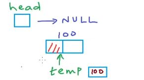

(2) head不指向NULL : 

先將新節點儲存一個指向舊首節點的地址(即圖中的100)，之後斷開head和舊首節點的連接，改成指向新節點。

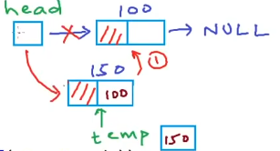

實作程式碼:
```C
//Linled List//
//Insert a node at beginning//

#include <stdlib.h>
#include <stdio.h>

typedef struct node
{
    int data;
    struct node* next;
}Node;
Node* head;

void insert(int data) {
	Node* temp = (Node*)malloc(sizeof(Node));
	temp->data = data; //same as (*temp).data = ...
	temp->next = NULL;

	if(head != NULL)temp->next = head;
	head = temp;
}

void print() {
	Node* temp = head;
	printf("List is:");
	while (temp != NULL) {
		printf("%d ", temp->data);
		temp = temp->next;
	}
	printf("\n");
}

int main() {
	head = NULL;
	int n, x;
	printf("How many number? ");
	scanf("%d", &n);
	for (int i = 0; i < n; i++) {
		printf("Enter the data：");
		scanf("%d", &x);
		insert(x);
		print();
	}
}
```
### 2. 在任意位置插入節點
這邊一樣是分成兩個情形處理，分別是:head指向NULL(即沒有節點)和head不指向NULL(即已經指向節點)

(1) head指向NULL : 

將head指向新節點


(2) head不指向NULL : 

假設要插入到第n個節點中(圖中假設要插入到3號節點)，先找到n-1的節點位置，之後將其所存的n節點位址(即圖中的250)放到新節點中，最後再將新節點的位址存到n-1節點中(250更新成150)。

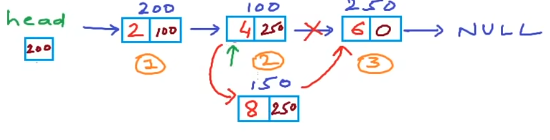

實作程式碼:
```c
//Linled List//
//Insert a node at n-th position//

#include <stdlib.h>
#include <stdio.h>

typedef struct node
{
    int data;
    struct node* next;
}Node;
Node* head;

void insert(int data, int n) {
	Node* temp1 = (Node*)malloc(sizeof(Node));
	temp1->data = data;
	temp1->next = NULL;
	if (n == 1) {
		temp1->next = head;
		head = temp1;
		return;
	}
	Node* temp2 = head;
	for (int i = 0; i < n - 2; i++) {
		temp2 = temp2->next;
	}
	temp1->next = temp2->next;
	temp2->next = temp1;
		 
}

void print() {
	Node* temp = head;
	while (temp != 0) {
		printf("%d ", temp->data);
		temp = temp->next;
	}
	printf("\n");
}

int main() {
	head = NULL;
	insert(3, 1);//3
	insert(1, 2);//3 1
	insert(6, 1);//6 3 1
	insert(4, 2);//6 4 3 1
	print();
}
```
## Linked List 刪除操作
### 1. 在指定位置刪除節點
思路:1.剪掉連接 2.釋放節點

一樣是分成兩個情形處理，分別是:刪掉首節點和刪掉首節點外的節點。

(1) 刪掉首節點 :

因為head是一個指針不是節點，所以需要單獨討論。將首節點所存的位址(即下圖的200)給head，最後在釋放空間。

(2) 刪掉首節點外的節點 :

假設要刪掉第n個節點(圖中假設刪掉3號節點)，先找到n-1的節點位置，之後將其所存的n節點位址(即圖中的150)更新成n+1節點的位址(即圖中的250)，最後在釋放第n個節點。

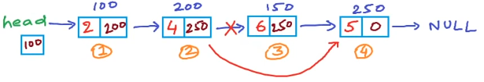

實作程式碼:(這裡Insert用的是尾插法)
```c
//Linled List//
//Insert a node at end + Delete a node at n-th position//

#include <stdlib.h>
#include <stdio.h>

typedef struct node
{
    int data;
    struct node* next;
}Node;
Node* head; 

void Insert(int data)
{
    Node* temp1 = (Node*)malloc(sizeof(Node));
    Node* temp2 = head;
    temp1->data = data;
    temp1->next = NULL;
    
    if(temp2 == NULL)
    {
        head = temp1;
        return;
    }
    
    while(temp2->next != NULL)
    {
        temp2 = temp2->next;
    }
    temp2->next = temp1;
}

void Print()
{
    Node* temp = head;
    while(temp != NULL)
    {
        printf("%d ", temp->data);
        temp = temp->next;
    }
    printf("\n");
}

void Delete(int n)
{
    Node* temp1 = head;
    
    if(n==1)
    {
        head = temp1->next;
        free(temp1);
        return;
    }
    
    for(int i = 0;i < n-2;i++)
    {
        temp1 = temp1->next; //n-1 node
    }
    
    Node* temp2 = temp1->next;//n node
    temp1->next = temp2->next;
    free(temp2);
    
}

int main()
{
    head = NULL;
    Insert(2);
    Insert(4);
    Insert(5);
    Insert(8); //2, 4, 5, 8
    Print();
    
    int n;
    printf("Enter n-th position:");
    scanf("%d", &n);
    Delete(n);
    Print();
    
    return 0;
}
```

## Linked List 反轉操作
這邊的反轉不是指將數據移動，如將下圖的5移動到2的位置，而是調整鏈的方向。這裡有兩種方法可以達成，分別是:Iterative(迭代)、Recursive(遞迴)。

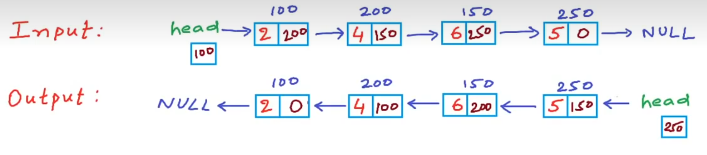

### 1. Iterative(迭代)
在迭代中使用迴圈來遍歷列表，每當遇到節點時，我們可以調整該節點的連接方向，讓其指向上一個節點而非下一個。

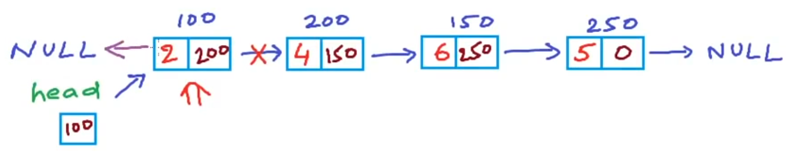

在反轉中，我們需要將節點指向上一個節點，但在鏈表中我們知道下一個節點的位置，但不知道上一個節點的位置，因此需要變量prev來跟蹤上一個節點的位置。

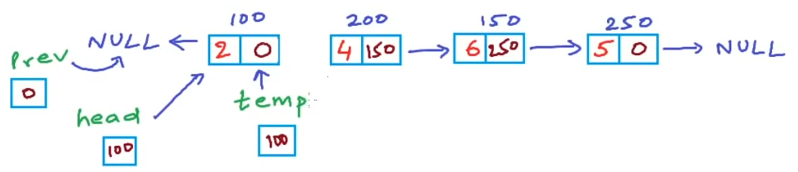

但在反轉之後，我們就無法到達下一個節點(即上圖斷開連接)，因此需要變量next來跟蹤下一個節點的位置。

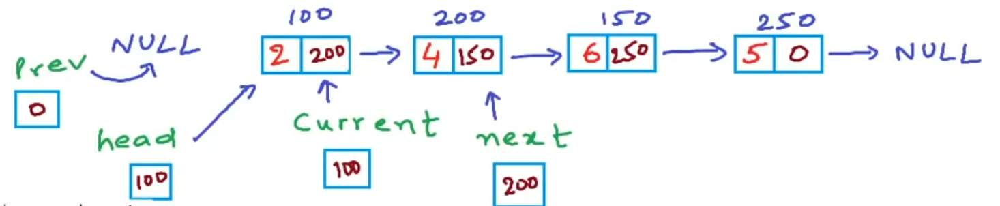
反轉
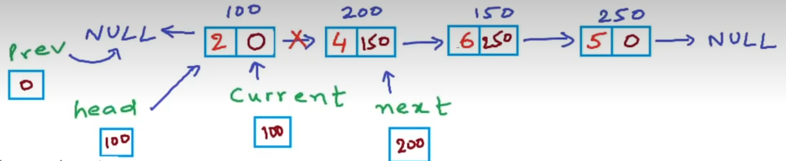

current把值給prev，之後移到下一節點
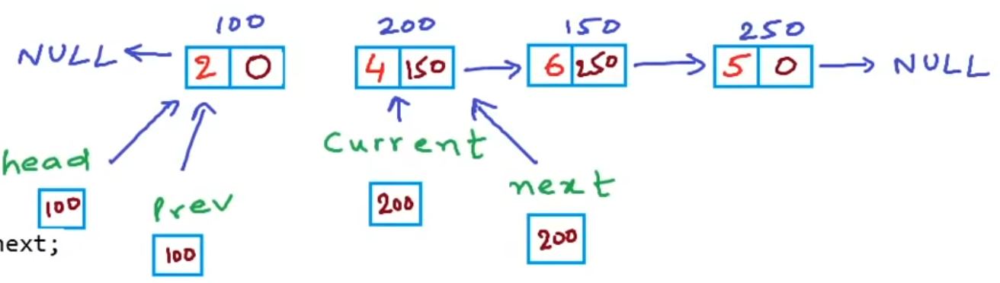

next移到下一節點，並反轉
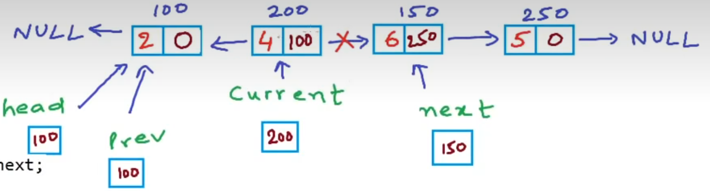

最後結果
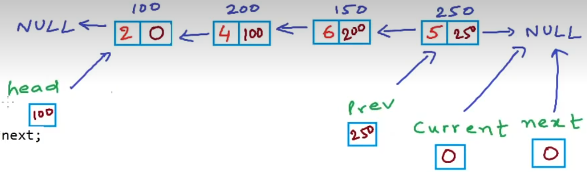

實作程式碼:(這裡Insert用的是尾插法)
```c
//Linled List//
//Reverse a linked list by iterativing//

#include <stdlib.h>
#include <stdio.h>

typedef struct node
{
    int data;
    struct node* next;
}Node;
Node* head; 

void Insert(int data)
{
    Node* temp1 = (Node*)malloc(sizeof(Node));
    Node* temp2 = head;
    temp1->data = data;
    temp1->next = NULL;
    
    if(temp2 == NULL)
    {
        head = temp1;
        return;
    }
    
    while(temp2->next != NULL)
    {
        temp2 = temp2->next;
    }
    temp2->next = temp1;
}

void Print()
{
    Node* temp = head;
    while(temp != NULL)
    {
        printf("%d ", temp->data);
        temp = temp->next;
    }
    printf("\n");
}

void Reverse()
{
    Node *prev, *current, *next;
    prev = NULL;
    current = head;

    while(current != NULL)
    {
        next = current->next;
        current->next = prev;

        prev = current;
        current = next;
    }
    head = prev;
}

int main()
{
    head = NULL;
    Insert(2);
    Insert(4);
    Insert(5);
    Insert(8); //2, 4, 5, 8
    printf("Linked list is ");
    Print();
    
    Reverse();
    printf("Reverse linked list is ");
    Print();
    
    return 0;
}
```

### 2. Recursive(遞迴)