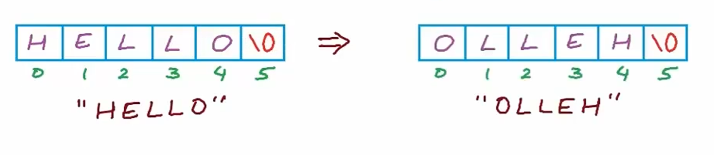
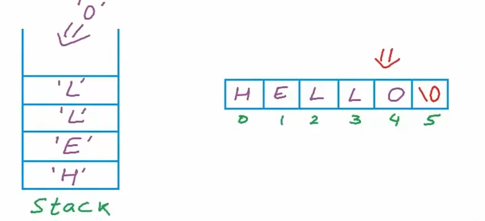
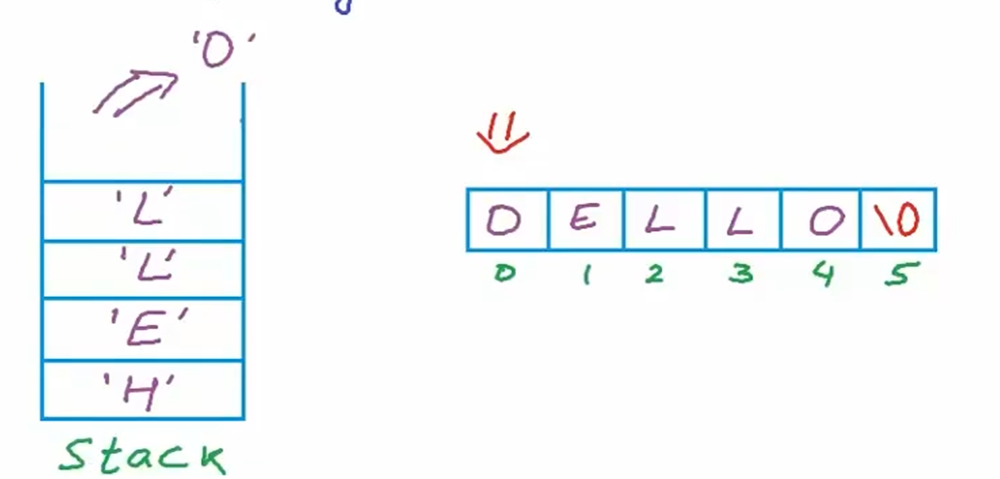
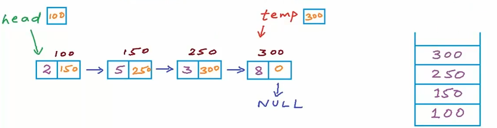
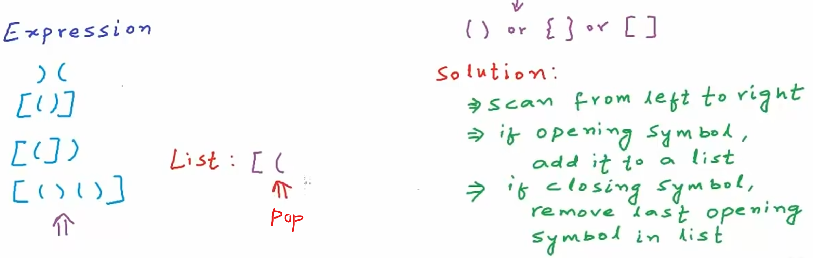
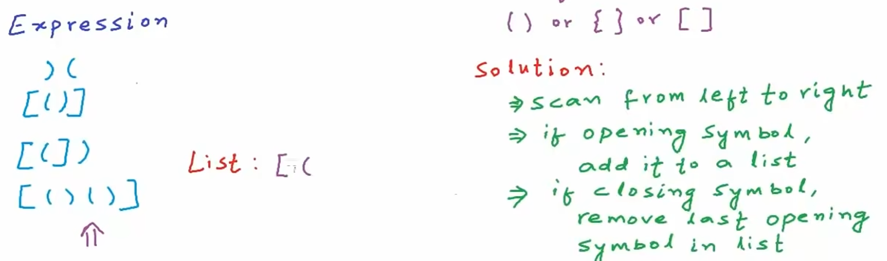

# Stack (堆疊)
Stack 是一種先進後出（FILO：First In Last Out）的資料結構。可以想像他是一個垂直地板而立的桶子，然後已經滿了，我們要搜尋最底下的東西，勢必要將其上層的物品一個一個拿走，最終才能取得最底下的物品。


## 為什麼要用 Stack?

Stack 很適合
- 函式呼叫管理、遞迴
- Undo 功能
- 括號匹配

## Stack 實現
### 1. Array實現版
思路:


實作程式碼:
```C
#include <stdio.h>
#define Max_Size 101

int A[Max_Size];
int top = -1;

void Push(int x)
{
    if(top == Max_Size -1 )
    {
        printf("Error: Stack Overflow\n");
        return;
    }
    top ++;
    A[top] = x; //same as A[++Top] = x
}

void Pop()
{
    if(top == -1 )
    {
        printf("Error: No element to pop\n");
        return;
    }
    top --;
}

int Top()
{
    return A[top];
}

void Print()
{
    int i;
    printf("Stack: ");
    for(i = 0;i <= top;i++)
    {
        printf("%d ", A[i]);
    }
    printf("\n");
}

int main()
{
    Push(2); Print();
    Push(5); Print();
    Push(10); Print();
    Pop(); Print();
    Push(2); Print();

    return 0;
}
```

### 2. Linked List實現版
思路: Linked List頭插法+頭刪法


實作程式碼:
```c
#include <stdio.h>
#include <stdlib.h>

typedef struct node
{
    int data;
    struct node *next;
}Node;

Node *top;

void Push(int x)
{
    Node *temp = malloc(sizeof(Node));
    temp->data = x;
    temp->next = top;
    top = temp;
}

void Pop()
{
    Node *temp = top;
    if(top == NULL)
    {
        return;
    }
    top = top->next;
    free(temp);
}

void Top()
{
    printf("Top: %d", top->data);
}

void Print()
{
    Node* temp = top;
    printf("Stack: ");
    while(temp != NULL)
    {
        printf("%d ", temp->data);
        temp = temp->next;
    }
    printf("\n");
}

int main()
{
    top = NULL;
    Push(2); Print();
    Push(5); Print();
    Push(10); Print();
    Pop(); Print();
    Push(2); Print();
    Top();
    
    return 0;
}
```
## 使用Stack做反轉
### 1. 反轉String


思路: 將字元一個一個放進Stack中


再將其一個一個取出放回


實作程式碼:
```c
#include <stdio.h>
#include <stdlib.h>
#include <string.h>

typedef struct node
{
    char data;
    struct node *next;
}Node;

Node *top;

void Push(char x)
{
    Node *temp = malloc(sizeof(Node));
    temp->data = x;
    temp->next = top;
    top = temp;
}

void Pop()
{
    Node *temp = top;
    if(top == NULL)
    {
        return;
    }
    top = top->next;
    free(temp);
}

char Top()
{
    if (top == NULL)
    {
        return '\0';
    }

    return top->data;
}

void Print()
{
    Node* temp = top;
    printf("Stack:\nabcde");
    while(temp != NULL)
    {
        printf("%c\n", temp->data);
        temp = temp->next;
    }
    printf("\n");
}

int main()
{
    top = NULL;

    printf("Input String: ");
    char s[101];
    scanf("%s", s);

    int len = strlen(s);
    for(int i = 0; i < len; i++)
    {
        Push(s[i]);
    }
    Print();

    for(int i = 0; i < len; i++)
    {
        s[i] = Top();
        Pop();
    }
    printf("Reverse: %s", s);

    return 0;
}
```

### 2. 反轉Linked List
思路: 將地址一個一個放進Stack中，再將其一個一個取出放回


實作程式碼: 可以用C++內建的stack去做，這邊用C分開寫一個stack、Linked List
```c
#include <stdio.h>
#include <stdlib.h>

typedef struct node // for list
{
    int data;
    struct node *next;
}Node;
Node *head = NULL; // list top

typedef struct stackNode // for stack
{
    Node* data;
    struct stackNode* next;
} StackNode;
StackNode *top = NULL; // stack top

//For stack function
void Push(Node *ptr)
{
    StackNode *temp = malloc(sizeof(Node));
    temp->data = ptr;
    temp->next = top;
    top = temp;
}

void Pop()
{
    StackNode *temp = top;
    if(top == NULL)
    {
        return;
    }
    top = top->next;
    free(temp);
}

Node *Top()
{
    return top->data;
}

int IsEmpty()
{
    return top == NULL;
}

//Reverse and Print
void Reverse()
{
    if(head == NULL) return;

    Node* temp = head;
    while(temp != NULL)
    {
        Push(temp);
        temp = temp->next;
    }
    temp = Top();
    head = temp;

    while(!IsEmpty())
    {
        temp->next = Top();
        Pop();
        temp = temp->next;
    }
    temp->next = NULL;
}

void Print()
{
    Node* temp = head;
    printf("Linked List: ");
    while(temp != NULL)
    {
        printf("%d ", temp->data);
        temp = temp->next;
    }
    printf("\n");
}

int main()
{
    // create linked list
    for(int i = 4; i >= 1; i--)
    {
        Node* temp = malloc(sizeof(Node));

        temp->data = i;
        temp->next = head;

        head = temp;
    }
    Print();

    Reverse();
    printf("Reverse ");
    Print();
    
    return 0;
}
```

## 使用Stack做括號匹配
思路: 將左括號一個一個Push進Stack中，後進的要先匹配到右括號才正確。匹配正確後則Pop。如果都正確，那最後Stack要是空的。



實作程式碼: 
```c
#include <stdio.h>
#include <stdlib.h>
#include <string.h>

//stack function start
typedef struct node
{
    char data;
    struct node *next;
}Node;

Node *top;

void Push(char x)
{
    Node *temp = malloc(sizeof(Node));
    temp->data = x;
    temp->next = top;
    top = temp;
}

void Pop()
{
    Node *temp = top;
    if(top == NULL)
    {
        return;
    }
    top = top->next;
    free(temp);
}

char Top()
{
    if (top == NULL)
    {
        return '\0';
    }

    return top->data;
}

int IsEmpty()
{
    return top == NULL;
}
//stack function end

int ArePair(char opening, char closing)
{
    if(opening == '(' && closing == ')')
        return 1;

    else if(opening == '{' && closing == '}')
        return 1;

    else if(opening == '[' && closing == ']')
        return 1;

    return 0;
}

int AreParanthesesBalanced(char* exp) //same as char exp[]
{
    for(int i = 0; i < strlen(exp); i++)
    {
        if(exp[i] == '(' || exp[i] == '{' || exp[i] == '[' )
        {
            Push(exp[i]);
        }
        else if(exp[i] == ')' || exp[i] == '}' || exp[i] == ']' )
        {
            if(IsEmpty() || !ArePair(Top(), exp[i]))
            {
                return 0;
            }
            Pop();
        }
    }
    return IsEmpty();
}

int main()
{
    top = NULL;

    printf("Enter an expression:  ");
    char s[101];
    scanf("%s", s);

	if(AreParanthesesBalanced(s))
		printf("Balanced\n");
	else
		printf("Not Balanced\n");

    return 0;
}
```