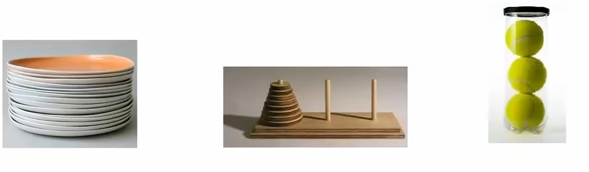
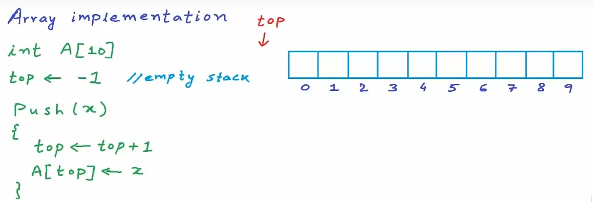
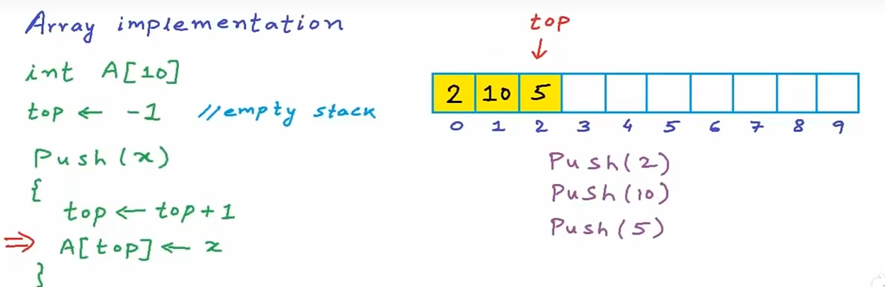
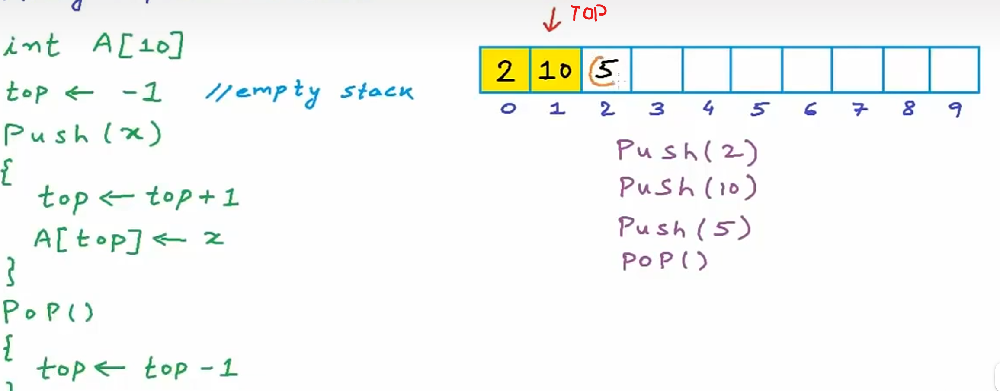
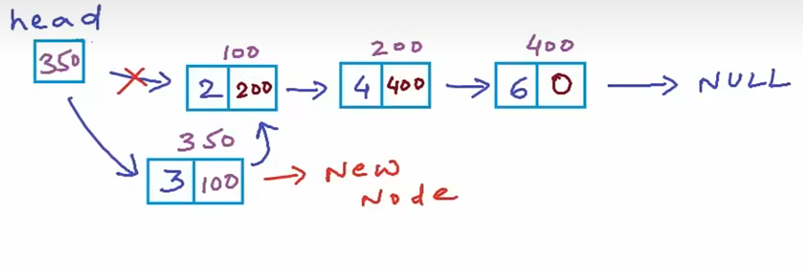

# Stack (堆疊)
Stack 是一種先進後出（FILO：First In Last Out）的資料結構。可以想像他是一個垂直地板而立的桶子，然後已經滿了，我們要搜尋最底下的東西，勢必要將其上層的物品一個一個拿走，最終才能取得最底下的物品。



## 為什麼要用 Stack?

Stack 很適合
- 函式呼叫管理、遞迴
- Undo 功能
- 括號匹配

## Stack 實現
### 1. Array實現版
思路:




實作程式碼:
```C
#include <stdio.h>
#define Max_Size 101

int A[Max_Size];
int top = -1;

void Push(int x)
{
    if(top == Max_Size -1 )
    {
        printf("Error: Stack Overflow\n");
        return;
    }
    top ++;
    A[top] = x; //same as A[++Top] = x
}

void Pop()
{
    if(top == -1 )
    {
        printf("Error: No element to pop\n");
        return;
    }
    top --;
}

int Top()
{
    return A[top];
}

void Print()
{
    int i;
    printf("Stack: ");
    for(i = 0;i <= top;i++)
    {
        printf("%d ", A[i]);
    }
    printf("\n");
}

int main()
{
    Push(2); Print();
    Push(5); Print();
    Push(10); Print();
    Pop(); Print();
    Push(2); Print();

    return 0;
}
```

### 2. Linked List實現版
思路: Linked List頭插法+頭刪法


實作程式碼:
```c
#include <stdio.h>
#include <stdlib.h>

typedef struct node
{
    int data;
    struct node *next;
}Node;

Node *top;

void Push(int x)
{
    Node *temp = malloc(sizeof(Node));
    temp->data = x;
    temp->next = top;
    top = temp;
}

void Pop()
{
    Node *temp = top;
    if(top == NULL)
    {
        return;
    }
    top = top->next;
    free(temp);
}

void Top()
{
    printf("Top: %d", top->data);
}

void Print()
{
    Node* temp = top;
    printf("Stack: ");
    while(temp != NULL)
    {
        printf("%d ", temp->data);
        temp = temp->next;
    }
    printf("\n");
}

int main()
{
    top = NULL;
    Push(2); Print();
    Push(5); Print();
    Push(10); Print();
    Pop(); Print();
    Push(2); Print();
    Top();
    
    return 0;
}
```
## 使用Stack做反轉
### 1. 反轉String
### 1. 反轉Linked List
